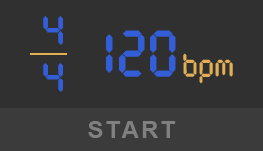

# Metronome

A simple metronome that has the ability to play odd time signatures.

## Usage
Choose tempo and meter by dragging the numbers with the mouse.

Press Start button or Space to start the metronome

## Installation
Go to Releases page and download the latest version of the installer. Then, simply follow the instructions of the installer.
